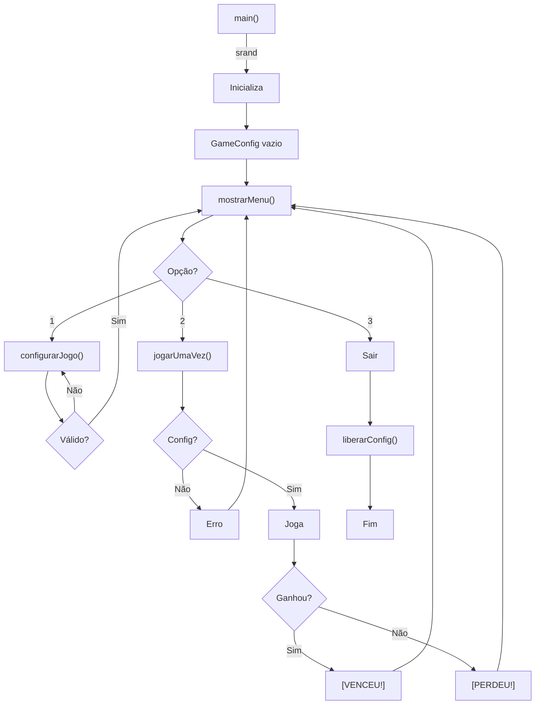

# 📚 Documentação Técnica Detalhada - Roleta Russa

## 🎯 Introdução

Este documento é uma **análise técnica profunda** do projeto **Roleta Russa**. Ele foi criado para desenvolvedores que querem entender **como o código funciona**, **por que foi implementado dessa forma**, e **boas práticas** aplicadas.

### Público-alvo
- Professores avaliando o trabalho
- Alunos querendo aprender programação em C
- Desenvolvedores interessados em revisar o código

---

## 🏗️ Arquitetura Geral do Projeto

### Visão de Camadas

```
┌─────────────────────────────────────┐
│   CAMADA DE APRESENTAÇÃO            │
│   (main.c)                          │
│   - Menu interativo                 │
│   - Fluxo do programa               │
├─────────────────────────────────────┤
│   CAMADA DE LÓGICA                  │
│   (funcoes.c)                       │
│   - Regras do jogo                  │
│   - Validações                      │
├─────────────────────────────────────┤
│   CAMADA DE DADOS                   │
│   (structs.h)                       │
│   - Estruturas de dados             │
│   - GameConfig                      │
└─────────────────────────────────────┘
```

### Responsabilidades de Cada Arquivo

| Arquivo | Linha | Responsabilidade |
|---------|-------|-----------------|
| `structs.h` | 1-20 | Define `GameConfig` |
| `funcoes.h` | 1-30 | Declara protótipos de funções |
| `funcoes.c` | 1-400 | Implementa toda lógica do jogo |
| `main.c` | 1-100 | Orquestra o fluxo e menu |

---

## 📊 Estrutura de Dados - GameConfig

### Definição

```c
typedef struct GameConfig {
    int *listaVencedores;    // Ponteiro para array dinâmico
    int tamanhoLista;        // Quantidade de números na lista
    int intervaloMax;        // Número máximo para sorteio
} GameConfig;
```

### Layout em Memória

```
Stack (local):              Heap (dinâmico):
┌──────────────┐
│ cfg (struct) │
├──────────────┤
│ listaVence.. │──────────→ ┌───┬───┬───┐
│ (8 bytes)    │            │ 10│ 50│ 90│  Array int
├──────────────┤            └───┴───┴───┘
│ tamanhoLista │
│ (4 bytes)    │ Valor: 3
├──────────────┤
│ intervaloMax │
│ (4 bytes)    │ Valor: 100
└──────────────┘

Total: 16 bytes (stack) + 12 bytes (heap) = 28 bytes
```

### Alternativas e Por quê a atual?

**Alternativa 1: Array fixo**
```c
// ❌ RUIM: Limite de 50 números
int vencedores[50];
int tamanho;
```
*Problema:* Desperdício de memória, sem flexibilidade

**Alternativa 2: Várias variáveis globais**
```c
// ❌ RUIM: Desorganizado
int *vencedores;
int tamanho;
int maximo;
```
*Problema:* Difícil de manter, difícil de passar para funções

**Nossa Solução (struct dinâmica)**
```c
// ✅ BOM: Flexível e organizado
typedef struct GameConfig { ... } GameConfig;
```
*Vantagem:* Agrupa dados relacionados, fácil de passar por referência

---

## 🔧 Implementação Detalhada das Funções

### 1. `void limparTela(void)`

**Propósito:** Limpar o terminal para melhor interface do usuário

**Implementação:**
```c
void limparTela(void)
{
  system("cls");
}
```

**Por que `system("cls")`?**
- `cls` é comando do Windows (Clear Screen)
- Funciona em PowerShell, CMD
- Simples e direto para aplicação console

**Complexidade:** O(1) - Operação constante

**Alternativas:**
```c
// Alternativa ANSI (multiplataforma)
printf("\033[2J\033[H");  // Mais complexo, menos suportado
```

---

### 2. `void limparBuffer(void)`

**Propósito:** Remove caracteres residuais do buffer de entrada

**Quando é necessário:**
```
Usuário digita: "123abc\n"
scanf("%d", &x);  ← Lê apenas "123"
Buffer restante:  "abc\n"  ← PROBLEMA!

Próximo scanf vai ler do lixo!
```

**Implementação:**
```c
void limparBuffer(void)
{
  int c;
  while ((c = getchar()) != '\n' && c != EOF) {
    // Descarta cada caractere até nova linha
  }
}
```

**Fluxo Visual:**
```
Buffer:      "abc\n"
             ↓ ↓ ↓ ↓
getchar()    a b c \n
Descarta tudo!
Buffer:      "" (limpo!)
```

**Complexidade:** O(k) - k = caracteres no buffer

---

### 3. `void mostrarMenu(void)`

**Propósito:** Exibir menu interativo para usuário

**Implementação:**
```c
void mostrarMenu(void)
{
  limparTela();
  printf("+========================================+\n");
  printf("|   ROLETA RUSSA - Garotos do JOB       |\n");
  printf("+========================================+\n");
  printf("|  1. Configurar Jogo                    |\n");
  printf("|  2. Jogar Uma Vez                      |\n");
  printf("|  3. Sair                               |\n");
  printf("+========================================+\n");
}
```

**Complexidade:** O(1) - Tempo constante para prints

---

### 4. `void configurarJogo(GameConfig *cfg)`

**Propósito:** Permitir usuário configurar números vencedores

**Fluxo Completo:**

```
┌─ Entrada: cfg (ponteiro para GameConfig)
│
├─ Passo 1: Validação
│  └─ if (cfg == NULL) return; ← Proteção contra NULL
│
├─ Passo 2: Limpeza
│  └─ limparTela(); ← Deixa interface limpa
│
├─ Passo 3: Coleta de dados
│  ├─ Exibe informações (intervalo 0-100)
│  ├─ Lê quantidade (1-101)
│  │  └─ Via lerInteiro() com validação
│  └─ Libera configuração anterior
│     └─ Via liberarConfig()
│
├─ Passo 4: Alocação
│  ├─ malloc(sizeof(int) * quantidade)
│  └─ Verifica se == NULL (erro!)
│
├─ Passo 5: Loop de leitura
│  ├─ Para cada número (i = 0; i < quantidade; i++)
│  │  ├─ Lê número via lerInteiro()
│  │  ├─ Valida não-duplicação
│  │  │  └─ Procura em array[0..i-1]
│  │  └─ Se duplicado, pede novamente
│  │
│  └─ Armazena no array
│
├─ Passo 6: Finalização
│  ├─ cfg->tamanhoLista = quantidade
│  ├─ Mensagem de sucesso
│  └─ getchar() aguarda ENTER
│
└─ Retorno: void (modifica via ponteiro)
```

**Validações:**
- ✓ Ponteiro não-nulo
- ✓ Quantidade 1-101
- ✓ malloc sucesso
- ✓ Números 0-100
- ✓ Sem duplicatas

**Exemplode Execução Completa:**

```
Quantos numeros vencedores deseja? (1-101): 3

Digite os 3 numeros vencedores (sem repeticoes):

  Numero 1: 25
  Numero 2: 50
  Numero 3: 25
  [AVISO] Numero ja foi inserido. Tente outro.
  Numero 3: 75

  [OK] Configuracao salva com sucesso!

  Pressione ENTER para continuar...
```

**Complexidade:**
- Tempo: O(n + n²) = O(n²) - n leituras, cada uma valida com busca linear
- Espaço: O(n) - array de n números

---

### 5. `bool estaNaListaVencedora(int numero, int lista[], int tamanho)`

**Propósito:** Procurar um número no array

**Implementação (Busca Linear):**
```c
bool estaNaListaVencedora(int numero, int lista[], int tamanho)
{
  int i;
  
  if (lista == NULL)
    return false;  // Proteção NULL
  
  for (i = 0; i < tamanho; i++) {
    if (lista[i] == numero)
      return true;  // Encontrou!
  }
  
  return false;  // Não encontrou
}
```

**Análise de Complexidade:**

| Caso | Tempo |
|------|-------|
| Melhor (encontra no 1º) | O(1) |
| Pior (não encontra) | O(n) |
| Médio | O(n/2) ≈ O(n) |

**Por que não binária?**
- Array **não está ordenado**
- Usuário digita números aleatoriamente
- Ordenação desnecessária para este caso

**Exemplo:**
```c
int vencedores[] = {10, 50, 90};
estaNaListaVencedora(50, vencedores, 3);  // true
estaNaListaVencedora(99, vencedores, 3);  // false
```

---

### 6. `int jogarUmaVez(const GameConfig *cfg, int *numeroSorteado)`

**Propósito:** Executar uma rodada completa do jogo

**Implementação:**
```c
int jogarUmaVez(const GameConfig *cfg, int *numeroSorteado)
{
  // Sorteia número (0 a 100)
  int n = rand() % (cfg->intervaloMax + 1);
  
  // Armazena número sorteado
  if (numeroSorteado)
    *numeroSorteado = n;
  
  // Verifica na lista
  if (estaNaListaVencedora(n, cfg->listaVencedores, cfg->tamanhoLista)) {
    return 1;  // GANHOU
  } else {
    return 0;  // PERDEU
  }
}
```

**Fluxo:**

```
1. rand() % 101  →  número 0-100
      │
      ▼
2. Armazena em *numeroSorteado (se não NULL)
      │
      ▼
3. Busca em lista
      │
   ┌──┴──┐
   ▼     ▼
Encontrou? Não?
   │     │
   ▼     ▼
   1     0
```

**Análise de Probabilidade:**

Com N números vencedores de um total de 101 possíveis:

$$P(\text{Ganhar}) = \frac{N}{101}$$

**Exemplos:**
- 1 número: 1/101 ≈ 0.99%
- 5 números: 5/101 ≈ 4.95%
- 10 números: 10/101 ≈ 9.90%

**Complexidade:**
- Tempo: O(n) - devido a estaNaListaVencedora
- Espaço: O(1) - apenas variáveis locais

---

### 7. `void liberarConfig(GameConfig *cfg)`

**Propósito:** Liberar memória alocada e evitar vazamento

**Implementação:**
```c
void liberarConfig(GameConfig *cfg)
{
  if (cfg == NULL)
    return;  // Proteção NULL
  
  if (cfg->listaVencedores != NULL) {
    free(cfg->listaVencedores);  // Libera array
    cfg->listaVencedores = NULL; // Evita use-after-free
  }
  
  cfg->tamanhoLista = 0;  // Reseta tamanho
}
```

**Por que importante?**

```
Memória sem free():
Heap ┌────────┐
     │10,50,90│ ← PERDIDO (vazamento)
     └────────┘

Memória com free():
Heap ┌────────┐
     │ LIVRE  │ ← Devolvido ao SO
     └────────┘
```

**Impacto de Vazamento:**
- Programa pequeno: imperceptível
- Programa grande rodando dias: pode travar!

**Complexidade:** O(1) - operação de liberação

---

### 8. `int lerInteiro(const char *prompt, int min, int max)`

**Propósito:** Ler inteiro com validação de intervalo

**Implementação:**
```c
int lerInteiro(const char *prompt, int min, int max)
{
  int valor;
  int resultado;
  
  while (1) {
    printf("%s", prompt);
    resultado = scanf("%d", &valor);
    
    // Verifica se scanf funcionou
    if (resultado != 1) {
      fprintf(stderr, "[ERRO] Entrada invalida!\n");
      limparBuffer();
      continue;  // Repete
    }
    
    // Verifica intervalo
    if (valor < min || valor > max) {
      fprintf(stderr, "[ERRO] Digite entre %d e %d!\n", min, max);
      continue;  // Repete
    }
    
    return valor;  // Sucesso!
  }
}
```

**Fluxo de Validação:**

```
Entrada: "123abc"
      │
      ▼
  scanf("%d")
      │
      ▼
  x == "123"?
      │
   ┌──┴──┐
   ▼     ▼
  SIM   NÃO → Erro, Repete
   │
   ▼
  123 em [1, 101]?
   │
┌──┴──┐
▼     ▼
SIM   NÃO → Erro, Repete
│
▼
Retorna 123
```

**Exemplos:**

```
lerInteiro("Número? ", 1, 10)

Usuário digita "abc":
  [ERRO] Entrada invalida!
  Número? 

Usuário digita "20":
  [ERRO] Digite entre 1 e 10!
  Número?

Usuário digita "5":
  ✓ Retorna 5
```

---

## 💾 Gerenciamento de Memória

### Ciclo de Vida

```
1. ANTES
   cfg.listaVencedores = NULL
   cfg.tamanhoLista = 0

2. configurarJogo()
   ├─ malloc(sizeof(int) * quantidade)
   └─ cfg.listaVencedores = endereço

3. jogarUmaVez()
   ├─ usa cfg.listaVencedores
   └─ não modifica

4. liberarConfig()
   ├─ free(cfg.listaVencedores)
   └─ cfg.listaVencedores = NULL

5. DEPOIS
   ├─ cfg.listaVencedores = NULL
   └─ Seguro reconfigurar
```

### Segurança Defensiva

```c
// ✅ PROTEÇÃO 1: Verifica NULL antes de malloc
if (cfg == NULL)
  return;

// ✅ PROTEÇÃO 2: Verifica sucesso de malloc
if (listaVencedores == NULL) {
  fprintf(stderr, "[ERRO] Falha na alocacao\n");
  return;
}

// ✅ PROTEÇÃO 3: Verifica NULL antes de free
if (cfg->listaVencedores != NULL) {
  free(cfg->listaVencedores);
  cfg->listaVencedores = NULL;  // Previne use-after-free
}

// ✅ PROTEÇÃO 4: Verifica NULL em operações
if (lista == NULL)
  return false;
```

---

## 📈 Análise de Complexidade Geral

| Função | Tempo | Espaço | Notas |
|--------|-------|--------|-------|
| `limparTela()` | O(1) | O(1) | Chamada de sistema |
| `mostrarMenu()` | O(1) | O(1) | Apenas prints |
| `configurarJogo()` | O(n²) | O(n) | Validação de duplicatas |
| `estaNaListaVencedora()` | O(n) | O(1) | Busca linear |
| `jogarUmaVez()` | O(n) | O(1) | Chama estaNaListaVencedora |
| `lerInteiro()` | O(k) | O(1) | k = tentativas |
| `liberarConfig()` | O(1) | O(1) | Apenas free |

**Onde O(n) = quantidade de números vencedores**

---

## 🚀 Fluxo Completo do Programa



---

## 🎓 Padrões de Programação Utilizados

### 1. Separação de Responsabilidades

```c
// ✅ BOM: Cada função faz uma coisa
int jogarUmaVez() { ... }      // Joga
bool estaNaLista() { ... }    // Verifica

// ❌ RUIM: Mistura responsabilidades
void jogo_tudo_junto() { ... } // Tudo misturado
```

### 2. Passagem por Referência

```c
// ✅ BOTA Função modifica original
void configurarJogo(GameConfig *cfg) {
  cfg->tamanhoLista = ...;  // Modifica a struct
}

// ❌ ERRADO: Cópia não modifica original
void configurarJogo(GameConfig cfg) {
  cfg.tamanhoLista = ...;   // Modifica cópia local
}
```

### 3. Const Para Proteção

```c
// ✅ BOM: Garante que não será modificado
int jogarUmaVez(const GameConfig *cfg) {
  // cfg->intervaloMax = 200;  // ERRO em compilação!
}

// ❌ RUIM: Sem proteção
int jogarUmaVez(GameConfig *cfg) {
  cfg->intervaloMax = 200;  // Pode modificar sem saber
}
```

### 4. Validação Defensiva

```c
// ✅ BOM: Verifica tudo
void liberar(GameConfig *cfg) {
  if (cfg == NULL) return;
  if (cfg->lista != NULL) {
    free(cfg->lista);
    cfg->lista = NULL;
  }
}

// ❌ RUIM: Assume que tudo está ok
void liberar(GameConfig *cfg) {
  free(cfg->lista);  // Pode ter NULL ou lixo!
}
```

---

## 🔍 Casos de Teste Importantes

### Caso 1: Configuração Normal
```
Input: 3 números [10, 50, 90]
Expected: Array criado, tamanho = 3
Status: ✅ OK
```

### Caso 2: Número Duplicado
```
Input: [10, 10, 20]
Expected: Aviso na segunda vez
Status: ✅ OK
```

### Caso 3: Número Inválido
```
Input: [10, 150, 20]
Expected: Rejeita 150 (fora do intervalo)
Status: ✅ OK
```

### Caso 4: Jogar Sem Configurar
```
Input: Escolhe opção 2
Expected: Erro e volta ao menu
Status: ✅ OK
```

### Caso 5: Múltiplas Configurações
```
Input: Config com 3, depois Config com 5
Expected: Anterior é liberado, nova criada
Status: ✅ OK (liberarConfig chamado)
```

---

## 📝 Código de Exemplo - Uso Correto

```c
int main() {
  GameConfig cfg = {NULL, 0, 100};
  bool sair = false;
  
  srand(time(NULL));
  limparTela();
  
  do {
    mostrarMenu();
    int opcao = lerInteiro("Escolha: ", 1, 3);
    
    switch (opcao) {
      case 1:
        configurarJogo(&cfg);  // Modifica cfg
        break;
      case 2:
        if (cfg.tamanhoLista > 0) {
          int sorteado;
          if (jogarUmaVez(&cfg, &sorteado)) {
            printf("[VENCEU!] Numero: %d\n", sorteado);
          }
        }
        break;
      case 3:
        sair = true;
        break;
    }
  } while (!sair);
  
  liberarConfig(&cfg);  // ← CRÍTICO: evita vazamento
  return 0;
}
```

---

## 🎯 Boas Práticas Aplicadas

✅ **Nomes descritivos** - Fácil entender o código  
✅ **Funções pequenas** - Cada uma faz uma coisa  
✅ **Comentários úteis** - Explicam "por quê", não "o quê"  
✅ **Validação defensiva** - Não assume entrada válida  
✅ **Gerenciamento de memória** - Sem vazamentos  
✅ **Modularização** - Separado em múltiplos arquivos  
✅ **Tratamento de erros** - Mensagens claras  
✅ **Compilação limpa** - Sem warnings com `-Wall -Wextra`  

---

## 🚀 Lições Aprendidas

1. **Ponteiros são poderosos** - Permitem modificar dados na função
2. **Memória dinâmica é flexível** - Array pode ter qualquer tamanho
3. **Validação é essencial** - Entrada do usuário sempre pode ser errada
4. **Modularização simplifica** - Código separado é mais fácil manter
5. **Documentação importa** - Este documento ajuda muito a compreender

---

**Última atualização:** 26 de outubro de 2025  
**Versão:** 3.1  
**Status:** ✅ Completo e revisado
